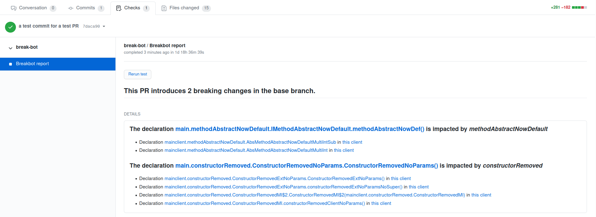

# Break-bot

A GitHub App built with [Probot](https://github.com/probot/probot), designed to help developpers measure the impacct of the updates of their libraries on their clients.
Once installed on a repository, it will publish a report as a check on each new pull request. This report contains a list of the breaking changes created by this PR, compared to the base branch, and a list of the clients impacted for each PR.



## Content
1. [How to start breakbot](#how-to-start-breakbot)
2. [Configure Breakbot](#configure-breakbot)
3. [Other ressources](#other-ressources)

## How to start breakbot

### Locally
This doesn't work right now unless you change the adress both in the configuration variables (the .env file) and on the app configuration page.
```sh
# Install dependencies
npm install

# Build the app
npm run build

# Run the bot
npm start
```

### Locally with heroku
Not recommended since there is an issue with accessing configuration variables (see [code details](DOC_BREAKBOT.md), the last part, Hosting, for more details).
Uses the Procfile to start, instead of the package.json
```sh
# Install dependencies
npm install

# Build the app
npm run build

# Run the bot
heroku local web
```

### Deploy on heroku
For more informations, see the last part **Hosting: Heroku**
```sh
# To push from main
git push heroku main

# To push from a different branch than main
git push heroku testbranch:main
```

## Configure Breakbot

### Configuration file

In a file named .breakbot.yml, located at the root of your repository, you can declare the following parameters:

Name | affects
--- | ---
maxDisplayedBC     |the greatest number of **breaking changes** that can be displayed  
maxDisplayedClients|the maximum of **clients** displayed for each **breaking change**


### Configuration variables

Located in .env during local developpment, and directly managed by heroku.

#### Used by probot
- APP\_ID: the id given by github to the app when registered
- GITHUB\_CLIENT\_ID: ?
- GITHUB\_CLIENT\_SECRET: ?
- PRIVATE\_KEY: the RSA access key used to connect as an app to github, read differently in heroku local development mode
- WEBHOOk\_PROXY\_URL: the adress of the app (is also declared diectly on github)
- WEBHOOK\_SECRET: ?

#### Unique to breakbot
- MARACAS\_URL: The url of Maracas API, which performs the tests

## Other ressources

### Dode Details

For more details on the code, see the [code details](DOC_BREAKBOT.md)

### Contributing

If you have suggestions for how breakbot could be improved, or want to report a bug, open an issue! We'd love all and any contributions.

For more, check out the [Contributing Guide](CONTRIBUTING.md).

### License

[ISC](LICENSE) © 2021 RIZZO Leonard <leonard.rizzo@gmx.com>
