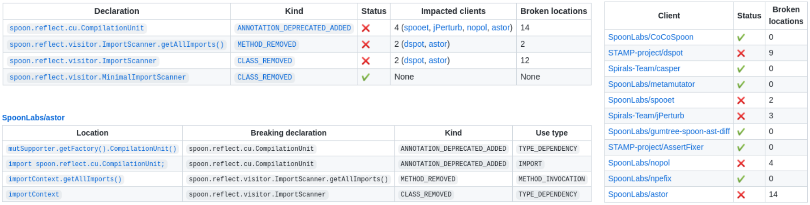

# BreakBot

> If we make this change to our code, how will it impact our clients?

> What if I remove this type? What if I deprecate this method? What if I change this field's type? What if I introduce this new method?

It is difficult for library maintainers to answer these simple—yet essential!—questions when evolving their libraries.
Understanding the impact of a change on your own codebase is complicated enough, so how can you understand its impact on code that you've never even heard of?

BreakBot is a GitHub App, built with [Probot](https://github.com/probot/probot), which automatically tracks the introduction of breaking changes in Java libraries and their impact on client projects.
Once installed on a repository, BreakBot listens to all pull requests and creates [GitHub check runs](https://docs.github.com/en/pull-requests/collaborating-with-pull-requests/collaborating-on-repositories-with-code-quality-features/about-status-checks). These checks highlight the breaking changes introduced by the pull requests and the impact they have on a selected set of client projects.
This information feeds the code review process and helps maintainers to decide whether the changes should be accepted in their current form or not.

## Content
1. [About BreakBot](#about-breakbot)
2. [Configuration](#configurations)
3. [Installation](#installation)
4. [Other Resources](#other-resources)
5. [Future Work](#future-work)


## About BreakBot

### Reports
BreakBot reports consist of a summary that summarizes the list and impact of breaking changes, e.g.:

> This pull request introduces **3 breaking changes**, causing **22 detections** in client code.
> **3 of 30 clients** are impacted by the changes (10%).




### Supported Breaking Changes

The underlying analysis is realized using [Maracas](https://github.com/alien-tools/maracas), which in turn relies on [japicmp](https://github.com/siom79/japicmp).

Once installed on a repository, it will publish a report as a check on each new pull request. This report contains a list of the breaking changes created by this PR, compared to the base branch, and a list of the clients impacted for each PR.


## Configuration
Similar to other GitHub Apps, BreakBot configuration must be hosted in a file `.github/breakbot.yml` directly within the repository.

### Build
To conduct the analyses, BreakBot needs to be able to build the library and produce a JAR file for both the `base` and `head` branches of the pull requests. Currently, only Maven is supported, and BreakBot will attempt to run a `mvn package` from the repository's root, looking for a resulting JAR in the `target/` directory.
It is however possible to configure a different `pom.xml` file, goal, and properties:

```yaml
build:
  # Only build a submodule
  pom: module/pom.xml
  # Custom goals
  goals: [clean jar-goal]
  # Skipping dependency clean and assembly to speed up the analyses
  properties: [skipTests, skipDepClean, assembly.skipAssembly]
```

### Clients
BreakBot needs to know about a list of clients to analyze. Currently, they have to be supplied manually as a list of GitHub repositories (denoted `owner/repo`).
By default, BreakBot looks for client code in the latest version (HEAD) of the repository's default branch, but this can be configured. [TODO: This part is not completely clear. What do you mean by client code here (e.g. tests)? ]
Note that, in contrast to the library itself, BreakBot does not need to build and produce a JAR for client projects.
Instead, BreakBot needs to know where the source files to analyze are located (by default, `src` or `src/main/java`).
If the source files are located elsewhere (e.g., in a particular submodule), this can be specified using the `sources` property.

```yaml
clients:
  # Analyze the latest version (HEAD) of the default branch of user1/repo1
  - repository: user1/repo1
  # Analyze a particular module from user1/repo2, at a particular commit
  - repository: user1/repo2
    sources: module/src/main/java
    sha: a3b98f
  # Analyze a particular branch of user2/repo1
  - repository: user2/repo1
    branch: dev
```

### Exclude some APIs from the analysis
Some parts of your APIs may be exempt from compatibility guarantees: types annotated with a `@Beta` annotation, everything within a `*.internal.*` package, etc. This can also be configured in the `breakbot.yml` file. All the elements matching the given patterns will be excluded from the analysis: no breaking changes will be reported.
[TODO: annotations and package naming conventions are the only mechanisms to exclude code? If so, it would be nice to specify it here, and be more concrete on how you refer to one or the other.]

```yaml
excludes:
  - '@Beta'
  - '*internal*'
```

## Installation


## Other Resources

### Contributing

If you have suggestions for how BreakBot could be improved, or want to report a bug, open an issue! We'd love all and any contributions.

For more information, check out the [Contributing guide](CONTRIBUTING.md).

### Contributors

  - Léonard Rizzo
  - Lina Ochoa
  - Thomas Degueule
  - Jean-Rémy Falleri


## Future Work

  - Automatically discover the clients to analyze, e.g. using Maven's dependency graph or GitHub's dependents list.
  - Build the list of breaking changes between two versions of a library from source code only, avoiding the need for building JARs and using japicmp.
